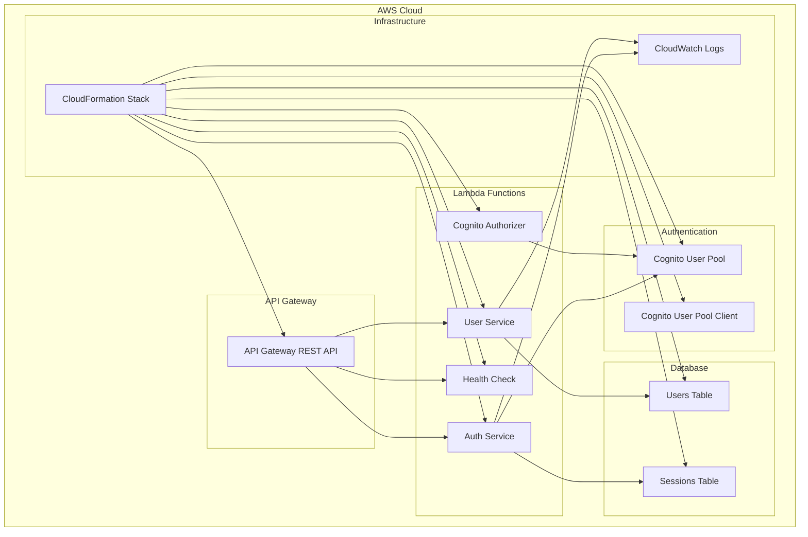

# 🚀 Deployment Guide - OAuth2 Authentication & User Management

Hướng dẫn deployment chi tiết cho **microservice authentication và user management system**.

## 📋 Prerequisites

### ✅ System Requirements
- **Node.js** >= 18.x
- **npm** >= 8.x
- **AWS CLI** >= 2.x
- **Serverless Framework** >= 2.x
- **AWS Account** với quyền đầy đủ

### ✅ AWS Services Required
- **Lambda** - Compute functions
- **API Gateway** - HTTP API endpoints
- **Cognito** - User authentication
- **DynamoDB** - Database
- **CloudFormation** - Infrastructure as Code
- **CloudWatch** - Logging & monitoring

### ✅ AWS Permissions
```json
{
  "Version": "2012-10-17",
  "Statement": [
    {
      "Effect": "Allow",
      "Action": [
        "lambda:*",
        "apigateway:*",
        "cognito-idp:*",
        "dynamodb:*",
        "cloudformation:*",
        "iam:*",
        "logs:*",
        "s3:*"
      ],
      "Resource": "*"
    }
  ]
}
```

## 🔧 Environment Setup

### 1. AWS Configuration
```bash
# Configure AWS CLI
aws configure

# Or use AWS profile
export AWS_PROFILE=your-profile-name

# Verify access
aws sts get-caller-identity
```

### 2. Install Dependencies
```bash
# Clone repository
git clone <repository-url>
cd microserviceSSo

# Install Node.js dependencies
npm install

# Install Serverless Framework globally
npm install -g serverless@2

# Verify installation
serverless --version
```

### 3. Environment Configuration
```bash
# Copy environment template
cp env.example env.dev

# Edit environment variables
nano env.dev
```

**env.dev** content:
```bash
# AWS Configuration
AWS_REGION=us-east-1
STAGE=dev

# Service Configuration
SERVICE_NAME=microservice-sso-auth-only
MEMORY_SIZE=128
TIMEOUT=30

# Optional: Custom domain (if you have one)
# CUSTOM_DOMAIN=auth.yourdomain.com
```

## 🏗️ Deployment Steps

### Step 1: Validate Configuration
```bash
# Validate Serverless configuration
npm run validate

# Check AWS connectivity
aws cloudformation list-stacks --output table
```

### Step 2: Deploy Infrastructure
```bash
# Deploy to development environment
npm run deploy:auth

# Or deploy with specific stage
serverless deploy --stage dev --config serverless-optimized.yml

# For production
serverless deploy --stage prod --config serverless-optimized.yml
```

### Step 3: Verify Deployment
```bash
# Get deployment info
serverless info --stage dev

# Test API Gateway endpoints
curl https://your-api-gateway-url/dev/health

# Check CloudFormation stack
aws cloudformation describe-stacks --stack-name microservice-sso-auth-only-dev
```

### Step 4: Create Admin User
```bash
# Get User Pool ID from deployment output
USER_POOL_ID=$(aws cloudformation describe-stacks \
  --stack-name microservice-sso-auth-only-dev \
  --query 'Stacks[0].Outputs[?OutputKey==`UserPoolId`].OutputValue' \
  --output text)

# Create admin user
aws cognito-idp admin-create-user \
  --user-pool-id $USER_POOL_ID \
  --username admin@example.com \
  --user-attributes Name=email,Value=admin@example.com Name=name,Value="Admin User" \
  --temporary-password TempPass123! \
  --message-action SUPPRESS

# Set permanent password
aws cognito-idp admin-set-user-password \
  --user-pool-id $USER_POOL_ID \
  --username admin@example.com \
  --password AdminPass123! \
  --permanent
```

### Step 5: Test Authentication Flow
```bash
# Get API Gateway URL
API_URL=$(aws cloudformation describe-stacks \
  --stack-name microservice-sso-auth-only-dev \
  --query 'Stacks[0].Outputs[?OutputKey==`ApiGatewayUrl`].OutputValue' \
  --output text)

# Test registration
curl -X POST $API_URL/auth/register \
  -H "Content-Type: application/json" \
  -d '{"email":"test@example.com","password":"Test123!","name":"Test User"}'

# Test login
curl -X POST $API_URL/auth/login \
  -H "Content-Type: application/json" \
  -d '{"email":"test@example.com","password":"Test123!"}'
```

## 📊 Deployment Architecture



## 🔐 Post-Deployment Configuration

### 1. Configure CORS (if needed)
```bash
# Update CORS settings in serverless-optimized.yml
# Then redeploy
serverless deploy --stage dev
```

### 2. Set up Custom Domain (Optional)
```bash
# Add domain configuration to serverless-optimized.yml
# Then deploy
serverless create_domain --stage dev
serverless deploy --stage dev
```

### 3. Configure OAuth2 Client
```bash
# Get Client ID
CLIENT_ID=$(aws cloudformation describe-stacks \
  --stack-name microservice-sso-auth-only-dev \
  --query 'Stacks[0].Outputs[?OutputKey==`UserPoolClientId`].OutputValue' \
  --output text)

echo "OAuth2 Client ID: $CLIENT_ID"
```

## 🧪 Testing Deployment

### 1. Start Local Test Server
```bash
# Start frontend testing dashboard
npm start

# Open browser
open http://localhost:3000
```

### 2. Run Integration Tests
```bash
# Test OAuth2 flows
curl -X GET "$API_URL/oauth2/authorize?response_type=code&client_id=$CLIENT_ID&redirect_uri=http://localhost:3000/callback"

# Test user management
curl -X GET $API_URL/users \
  -H "Authorization: Bearer $ACCESS_TOKEN"
```

### 3. Monitor Logs
```bash
# View logs
serverless logs --function authService --stage dev --tail

# View all functions logs
npm run logs
```

## 📈 Performance Optimization

### 1. Lambda Configuration
```yaml
# In serverless-optimized.yml
functions:
  authService:
    memorySize: 256  # Increase for better performance
    timeout: 30      # Adjust based on needs
    reservedConcurrency: 10  # Limit concurrent executions
```

### 2. DynamoDB Optimization
```yaml
# Add Auto Scaling (in resources section)
UsersTableWriteCapacityScalingPolicy:
  Type: AWS::ApplicationAutoScaling::ScalingPolicy
  Properties:
    PolicyType: TargetTrackingScaling
    # ... configuration
```

### 3. API Gateway Caching
```yaml
# Add caching configuration
events:
  - http:
      path: /users
      method: get
      caching:
        enabled: true
        ttlInSeconds: 300
```

## 🔄 CI/CD Pipeline

### GitHub Actions Example
```yaml
# .github/workflows/deploy.yml
name: Deploy Auth Service

on:
  push:
    branches: [main, develop]

jobs:
  deploy:
    runs-on: ubuntu-latest
    steps:
      - uses: actions/checkout@v2
      
      - name: Setup Node.js
        uses: actions/setup-node@v2
        with:
          node-version: '18'
          
      - name: Install dependencies
        run: npm ci
        
      - name: Deploy to AWS
        run: npm run deploy:auth
        env:
          AWS_ACCESS_KEY_ID: ${{ secrets.AWS_ACCESS_KEY_ID }}
          AWS_SECRET_ACCESS_KEY: ${{ secrets.AWS_SECRET_ACCESS_KEY }}
```

## 🛡️ Security Checklist

### ✅ Pre-deployment Security
- [ ] AWS credentials không hard-coded
- [ ] Environment variables được encrypt
- [ ] Sensitive data sử dụng AWS Secrets Manager
- [ ] IAM roles theo principle of least privilege

### ✅ Post-deployment Security
- [ ] Enable AWS CloudTrail
- [ ] Set up AWS Config rules
- [ ] Configure AWS WAF cho API Gateway
- [ ] Enable VPC Flow Logs (nếu sử dụng VPC)

## 🚨 Troubleshooting

### Common Issues

#### 1. Deployment Fails
```bash
# Check CloudFormation events
aws cloudformation describe-stack-events --stack-name microservice-sso-auth-only-dev

# Check Serverless logs
serverless deploy --verbose
```

#### 2. Lambda Function Errors
```bash
# View function logs
aws logs tail /aws/lambda/microservice-sso-auth-only-dev-authService

# Test function locally
serverless invoke local --function authService --data '{"httpMethod":"GET","path":"/health"}'
```

#### 3. API Gateway Issues
```bash
# Test API Gateway directly
aws apigateway test-invoke-method \
  --rest-api-id YOUR_API_ID \
  --resource-id YOUR_RESOURCE_ID \
  --http-method GET
```

#### 4. Cognito Issues
```bash
# Check User Pool configuration
aws cognito-idp describe-user-pool --user-pool-id $USER_POOL_ID

# List users
aws cognito-idp list-users --user-pool-id $USER_POOL_ID
```

## 🧹 Cleanup

### Remove Development Environment
```bash
# Remove CloudFormation stack
npm run remove

# Or specific stage
serverless remove --stage dev
```

### Remove All Resources
```bash
# Remove custom domain (if configured)
serverless delete_domain --stage dev

# Remove CloudFormation stack
aws cloudformation delete-stack --stack-name microservice-sso-auth-only-dev

# Wait for deletion
aws cloudformation wait stack-delete-complete --stack-name microservice-sso-auth-only-dev
```

## 📊 Monitoring & Maintenance

### Set up CloudWatch Alarms
```bash
# Create alarm for Lambda errors
aws cloudwatch put-metric-alarm \
  --alarm-name "AuthService-Errors" \
  --alarm-description "Auth Service Error Rate" \
  --metric-name Errors \
  --namespace AWS/Lambda \
  --statistic Sum \
  --period 300 \
  --threshold 5 \
  --comparison-operator GreaterThanThreshold
```

### Log Analysis
```bash
# Query CloudWatch Insights
aws logs start-query \
  --log-group-name /aws/lambda/microservice-sso-auth-only-dev-authService \
  --start-time 1609459200 \
  --end-time 1609462800 \
  --query-string 'fields @timestamp, @message | filter @message like /ERROR/'
```

---

## 🎯 Next Steps

1. **Production Deployment**: Follow same steps với `--stage prod`
2. **Custom Domain**: Configure domain mapping
3. **Monitoring**: Set up comprehensive monitoring
4. **Backup**: Configure DynamoDB backups
5. **Documentation**: Update team documentation

**🚀 Your authentication and user management system is now deployed and ready for production use!** 