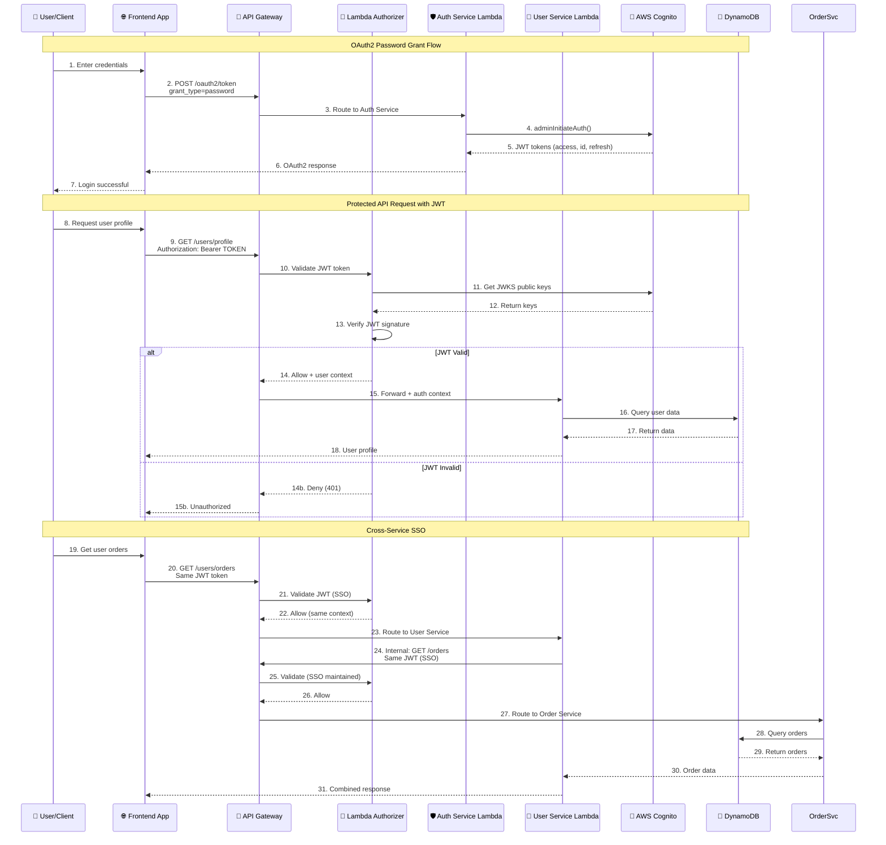
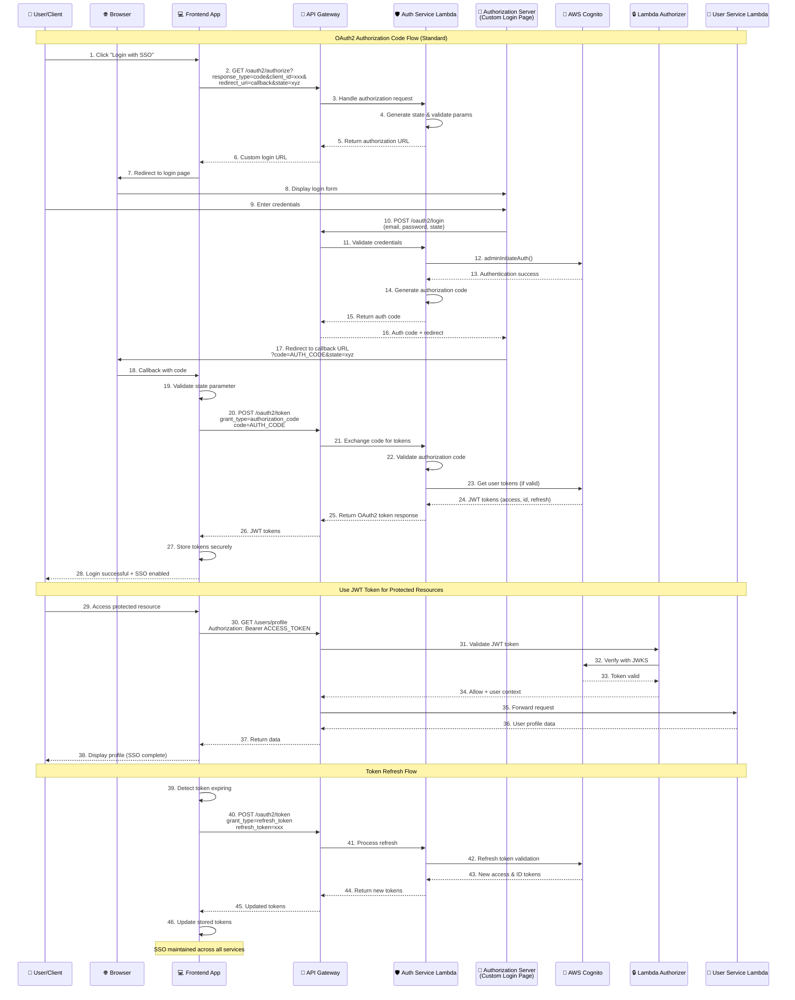

# 🚀 Microservice SSO với AWS Lambda

**Complete OAuth2 & SSO system** với AWS Lambda, API Gateway, Cognito, và DynamoDB.

## 🎯 Overview

**5 Microservices** với **Single Sign-On** authentication:
- 🔐 **Auth Service** - OAuth2 authentication flows
- 👥 **User Service** - User profile management  
- 📦 **Product Service** - Product catalog
- 🛒 **Order Service** - Order processing
- 🏥 **Health Check** - Service monitoring

## 🔄 OAuth2 & SSO Flows

### 🔐 **Flow 1: OAuth2 Password Grant** (Direct Authentication)



### 🔗 **Flow 2: OAuth2 Authorization Code** (Standard Enterprise Flow)



## 🏗️ Architecture

### **AWS Components**
- **API Gateway**: Single entry point, CORS, routing
- **Lambda Authorizer**: JWT validation với Cognito JWKS
- **Cognito User Pool**: User authentication & JWT issuing
- **Lambda Functions**: Business logic microservices
- **DynamoDB**: NoSQL database cho từng service

### **OAuth2 Flows Supported**
- ✅ **Password Grant**: Username/password → JWT tokens
- ✅ **Authorization Code**: Redirect-based flow
- ✅ **Client Credentials**: Service-to-service auth
- ✅ **Refresh Token**: Token renewal

### **SSO Features**
- 🔑 **Single Login**: One JWT for all services
- 🔄 **Token Reuse**: Cross-service authentication
- 🛡️ **Centralized Auth**: Cognito manages all users
- 📊 **Stateless**: JWT contains user context

## 🚀 Quick Start

### **Prerequisites**
```bash
# Required
node -v    # >= 18.x
aws --version
npm install -g serverless
```

### **Setup**
```bash
# 1. Install dependencies
npm install

# 2. Configure AWS
aws configure
# or
export AWS_PROFILE=your-profile

# 3. Deploy to AWS
npm run deploy
```

### **Test OAuth2 Flow**
```bash
# 1. Register user
curl -X POST https://your-api-url/auth/register \
  -H "Content-Type: application/json" \
  -d '{"email":"test@example.com","password":"Test123!","name":"Test User"}'

# 2. Login (OAuth2 Password Grant)
curl -X POST https://your-api-url/oauth2/token \
  -H "Content-Type: application/json" \
  -d '{"grant_type":"password","username":"test@example.com","password":"Test123!","client_id":"your-client-id"}'

# 3. Use JWT token for protected endpoints
curl -X GET https://your-api-url/users/profile \
  -H "Authorization: Bearer YOUR_JWT_TOKEN"
```

## 📋 API Endpoints

### **🔐 OAuth2 Authentication**
- `GET /oauth2/authorize` - Authorization code flow
- `POST /oauth2/token` - Token exchange (all grant types)
- `POST /oauth2/refresh` - Token refresh

### **👤 User Authentication**
- `POST /auth/register` - User registration
- `POST /auth/login` - Direct login
- `POST /auth/user-info` - Decode JWT tokens
- `GET /auth/profile` - Get user profile
- `POST /auth/logout` - Logout

### **🛡️ Protected Services**
- `GET /users` - User management (requires auth)
- `GET /products` - Product catalog  
- `GET /orders` - Order management (requires auth)
- `GET /health` - System health check

## 🎯 Current Deployment

### **✅ Production Ready**
- **API URL**: `https://f0ct5flua5.execute-api.us-east-1.amazonaws.com/dev`
- **User Pool**: `us-east-1_8ML8938m2`
- **Client ID**: `1rtq4ll07cvvatg432efpnjtta`
- **Test User**: `sso-test@example.com` / `SSOTest123!`

### **🧪 Frontend Test Dashboard**
```bash
# Local test server
node serve.js
# Open: http://localhost:3000

# Features:
# ✅ Interactive OAuth2 testing
# ✅ All grant flows UI
# ✅ JWT token management
# ✅ Cross-service SSO testing
```

## 📊 JWT Token Structure

### **Access Token** (Authorization)
```json
{
  "sub": "user-id",
  "username": "user-uuid", 
  "client_id": "app-client-id",
  "token_use": "access",
  "scope": "aws.cognito.signin.user.admin",
  "exp": 1234567890
}
```

### **ID Token** (User Identity)
```json
{
  "sub": "user-id",
  "email": "user@example.com",
  "name": "User Name",
  "email_verified": true,
  "token_use": "id",
  "exp": 1234567890
}
```

## 🔧 Development

### **Local Development**
```bash
npm run dev          # Serverless offline
npm test            # Run tests
npm run lint        # Code quality
```

### **Deployment**
```bash
npm run deploy      # Deploy to AWS
npm run deploy:prod # Production deploy
npm run info        # Stack info
npm run logs        # View logs
```

### **Utilities**
```bash
npm run remove      # Remove stack
npm run validate    # Validate config
npm run package     # Package functions
```

## 📁 Project Structure

```
microserviceSSo/
├── lambda/                    # 🔧 Lambda functions
│   ├── auth-service-minimal/  # OAuth2 + auth logic
│   ├── user-service/         # User management
│   ├── order-service/        # Order processing
│   ├── product-service/      # Product catalog
│   ├── cognito-authorizer/   # JWT validation
│   └── health-check/         # Health monitoring
├── shared/                   # 📦 Common utilities
├── serverless-optimized.yml  # ⭐ Main config
├── serverless-minimal.yml    # 🧪 Simple config
├── oauth2-sso-test.html      # 🌐 Test dashboard
├── guideline.md              # 📚 Complete guide
└── README.md                 # 📖 This file
```

## 🎯 Features

### **🔐 Authentication & Authorization**
- ✅ AWS Cognito User Pool
- ✅ JWT-based authentication
- ✅ Lambda Authorizer validation
- ✅ Role-based access control

### **🌐 OAuth2 & SSO**
- ✅ Complete OAuth2 implementation
- ✅ Multiple grant flows
- ✅ Cross-service Single Sign-On
- ✅ Token refresh mechanism

### **🏗️ Architecture**
- ✅ Serverless microservices
- ✅ API Gateway integration
- ✅ DynamoDB data persistence
- ✅ CloudFormation infrastructure

### **🛠️ Development**
- ✅ Environment-based deployment
- ✅ Optimized packaging
- ✅ Interactive test dashboard
- ✅ Complete documentation

## 📖 Documentation

- **[Complete Guide](guideline.md)** - Detailed architecture & implementation
- **[Deployment Guide](DEPLOYMENT.md)** - Step-by-step deployment
- **[Test Dashboard](oauth2-sso-test.html)** - Interactive OAuth2 testing

---

**🚀 Ready for production deployment with complete OAuth2 & SSO functionality!** 