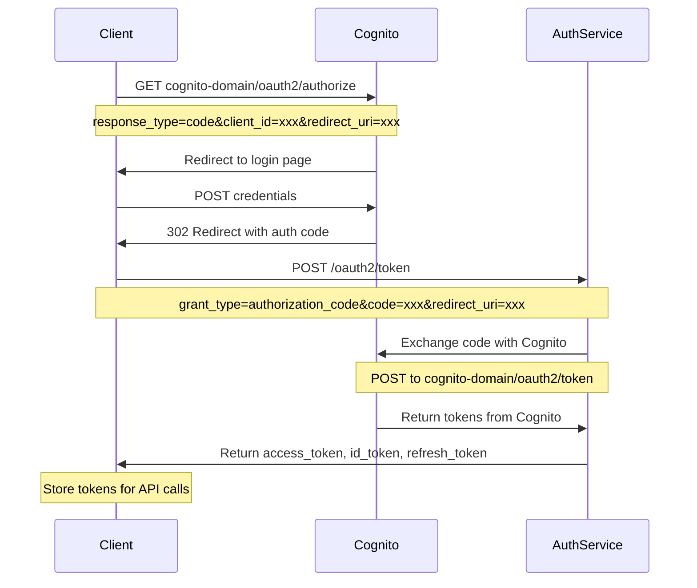
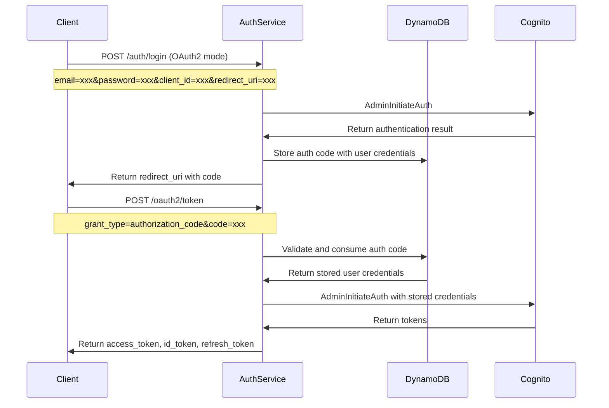
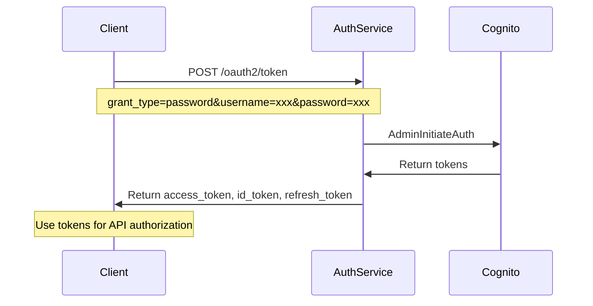
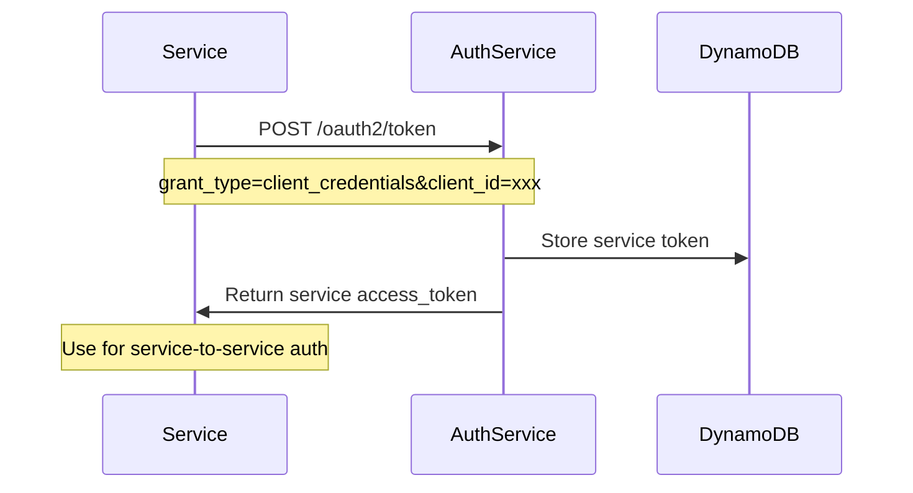

# 🔐 Microservice OAuth2 SSO Authentication

Microservice authentication system sử dụng **AWS Lambda**, **Amazon Cognito**, và **OAuth2** để cung cấp Single Sign-On (SSO) cho các ứng dụng.

## 🎯 Tính năng chính

- **OAuth2 Authorization Code Flow** - Chuẩn OAuth2 hoàn chỉnh
- **Password Grant Flow** - Đăng nhập trực tiếp với email/password  
- **Client Credentials Flow** - Xác thực service-to-service
- **Refresh Token** - Gia hạn token tự động
- **Amazon Cognito Integration** - User pool management
- **JWT-based SSO** - Single Sign-On across microservices

## 🏗️ Kiến trúc hệ thống

```
┌─────────────────┐    ┌─────────────────┐    ┌─────────────────┐
│   Frontend      │    │   Auth Service  │    │  User Service   │
│                 │    │                 │    │                 │
│ • OAuth2 Login  │────│ • Authorization │────│ • User CRUD     │
│ • JWT Storage   │    │ • Token Issue   │    │ • Profile Mgmt  │
│ • API Calls     │    │ • SSO Provider  │    │ • Role Check    │
└─────────────────┘    └─────────────────┘    └─────────────────┘
         │                       │                       │
         │              ┌─────────────────┐               │
         │              │   API Gateway   │               │
         │              │                 │               │
         └──────────────│ • CORS Handling │───────────────┘
                        │ • Route Management│
                        │ • Authorization │
                        └─────────────────┘
                                 │
                    ┌─────────────────────────────┐
                    │       AWS Resources         │
                    │                             │
                    │ • Cognito User Pool         │
                    │ • DynamoDB Tables          │
                    │ • Lambda Functions         │
                    │ • CloudFormation           │
                    └─────────────────────────────┘
```

## 🔄 OAuth2 Flow Sequence Diagrams

### 1. Authorization Code Flow (Cognito Hosted UI)



**Lưu ý**: Flow này sử dụng Cognito Hosted UI để xử lý authentication, sau đó AuthService chỉ đóng vai trò proxy để exchange authorization code với Cognito.

### 2. Authorization Code Flow (Direct Authentication)



### 3. Password Grant Flow



### 4. Client Credentials Flow



## 🚀 Bắt đầu nhanh

### Prerequisites
- **Node.js** 18.x hoặc cao hơn
- **AWS CLI** được cấu hình
- **Serverless Framework** 2.x

### 1. Cài đặt dependencies
```bash
npm install
```

### 2. Cấu hình environment
```bash
cp env.example env.dev
# Chỉnh sửa env.dev với thông tin AWS của bạn
```

### 3. Deploy lên AWS
```bash
npm run deploy:auth
```

### 4. Chạy local server
```bash
npm start
```

Frontend demo sẽ chạy tại `http://localhost:3000`

## 📋 API Endpoints

### 🔐 Authentication Service

#### Public Endpoints
```
GET  /health                    # Health check
GET  /auth/test                 # Service info
POST /auth/register             # User registration
POST /auth/login                # User login

# OAuth2 Flow
GET  /oauth2/authorize          # Authorization endpoint
POST /oauth2/token              # Token endpoint
POST /oauth2/refresh            # Refresh token
GET  /oauth2/userinfo           # User info endpoint
```

#### Protected Endpoints (require JWT)
```
GET  /auth/profile              # Get user profile
POST /auth/logout               # User logout
```

### 👤 User Management Service

#### Protected Endpoints (require JWT)
```
GET  /users                     # List users (admin) or own profile
POST /users                     # User actions (getProfile, updateProfile, etc.)
GET  /users/{id}                # Get user by ID
PUT  /users/{id}                # Update user
DELETE /users/{id}              # Delete user (admin only)
```

## 🔧 Configuration

### Environment Variables
```bash
# AWS Configuration
AWS_REGION=us-east-1
STAGE=dev

# Cognito Configuration
USER_POOL_ID=us-east-1_dXp683hoC
USER_POOL_CLIENT_ID=h1098nsapivi7j0nn3imjm4i5
COGNITO_DOMAIN=dev-auth-domain.auth.us-east-1.amazoncognito.com

# DynamoDB Tables
AUTH_CODES_TABLE=auth-codes-dev
SESSIONS_TABLE=sessions-dev
```

## 🎯 OAuth2 Flows Support

### 1. Authorization Code Flow
```javascript
// Step 1: Get authorization code
GET /oauth2/authorize?response_type=code&client_id=xxx&redirect_uri=xxx

// Step 2: Exchange code for tokens
POST /oauth2/token
{
  "grant_type": "authorization_code",
  "code": "auth_code",
  "client_id": "xxx",
  "redirect_uri": "xxx"
}
```

### 2. Password Grant Flow
```javascript
POST /oauth2/token
{
  "grant_type": "password",
  "username": "user@example.com",
  "password": "password123",
  "client_id": "xxx"
}
```

### 3. Client Credentials Flow
```javascript
POST /oauth2/token
{
  "grant_type": "client_credentials",
  "client_id": "xxx"
}
```

### 4. Refresh Token Flow
```javascript
POST /oauth2/refresh
{
  "refresh_token": "refresh_token_here"
}
```

## 🛡️ Security Features

- **JWT-based authentication** với Cognito
- **CORS protection** cho cross-origin requests
- **Role-based access control** (Admin/User)
- **Token expiration** và refresh mechanism
- **Input validation** và sanitization
- **Error handling** an toàn

## 📊 Database Schema

### Auth Codes Table (DynamoDB)
```json
{
  "code": "AUTH_1234567890_abc123",
  "clientId": "h1098nsapivi7j0nn3imjm4i5",
  "redirectUri": "http://localhost:3000/callback",
  "expiresAt": 1640995200,
  "createdAt": 1640994600000,
  "metadata": {
    "scope": "openid profile email",
    "state": "random_state",
    "username": "user@example.com"
  }
}
```

### Sessions Table (DynamoDB)
```json
{
  "token": "access_token_here",
  "userId": "user123",
  "tokenType": "access",
  "expiresAt": 1640998800,
  "createdAt": 1640995200000,
  "clientId": "h1098nsapivi7j0nn3imjm4i5"
}
```

## 🧪 Testing

### Test OAuth2 Flow
```bash
# 1. Start authorization flow
curl "http://localhost:3000/oauth2/authorize?response_type=code&client_id=h1098nsapivi7j0nn3imjm4i5&redirect_uri=http://localhost:3000/callback"

# 2. Exchange code for tokens
curl -X POST http://localhost:3000/oauth2/token \
  -H "Content-Type: application/x-www-form-urlencoded" \
  -d "grant_type=authorization_code&code=AUTH_CODE&client_id=h1098nsapivi7j0nn3imjm4i5&redirect_uri=http://localhost:3000/callback"

# 3. Use access token
curl -H "Authorization: Bearer ACCESS_TOKEN" http://localhost:3000/auth/profile
```

### Test Password Grant
```bash
curl -X POST http://localhost:3000/oauth2/token \
  -H "Content-Type: application/x-www-form-urlencoded" \
  -d "grant_type=password&username=user@example.com&password=password123&client_id=h1098nsapivi7j0nn3imjm4i5"
```

## 📝 Deployment Checklist

- [ ] AWS CLI configured
- [ ] Environment variables set
- [ ] Cognito User Pool created
- [ ] DynamoDB tables created
- [ ] Lambda functions deployed
- [ ] API Gateway configured
- [ ] CORS settings applied
- [ ] Frontend configured with correct endpoints

## 🤝 Contributing

1. Fork the repository
2. Create feature branch (`git checkout -b feature/amazing-feature`)
3. Commit changes (`git commit -m 'Add amazing feature'`)
4. Push to branch (`git push origin feature/amazing-feature`)
5. Open Pull Request

## 📄 License

This project is licensed under the MIT License - see the [LICENSE](LICENSE) file for details. 